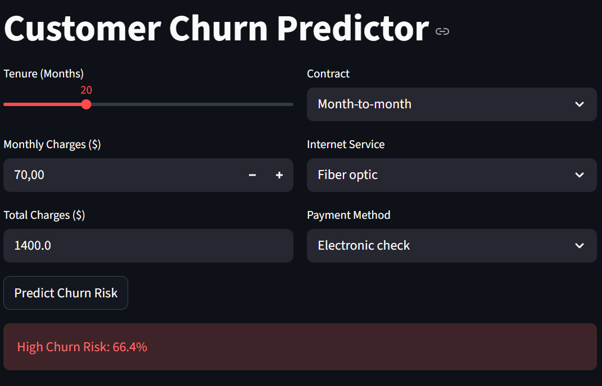

# Telco Customer Churn Prediction Pipeline

An end-to-end Machine Learning pipeline to predict customer churn, optimize retention strategies, and serve predictions via a REST API.


**Dataset source:** [Telco Customer Churn (Kaggle)](https://www.kaggle.com/blastchar/telco-customer-churn)

## Interface Demo
The project includes an interactive Streamlit dashboard that allows to simulate customer scenarios and predict churn probability in real-time.



## Business Context & ROI
**The Goal:** Identify customers at risk of churning to proactively offer retention incentives.

**Impact Analysis:**
* The model achieves a **ROC-AUC of 0.847** and a **Recall of ~80%**. By targeting the top risk segment identified by the model, a significantly higher ROI is projected compared to mass-marketing campaigns.

> *See [notebooks/model_selection.ipynb](notebooks/model_selection.ipynb) for detailed metrics and charts.*

## Project Architecture
```
├── api/                # FastAPI service for real-time predictions
├── data/               # Raw and processed datasets
├── notebooks/          # EDA and SHAP analysis
├── src/
│   └── churn/          # Core application logic
│       ├── preprocessing.py  # Sklearn transformers & cleaning
│       ├── train.py          # Training pipeline
│       └── dashboard.py      # Streamlit UI for demo
├── tests/              # Pytest integration tests
├── Dockerfile          # Containerization
└── docker-compose.yml  # Orchestration
```
##  Model Selection
After several experiments **LightGBM** was selected as the production model due to the best trade-off between accuracy and inference speed.

| Model | ROC-AUC | Recall | Decision |
|-------|---------|--------|----------|
| **LightGBM** | **0.847** | **0.80** | **Selected (Fast & Accurate)** |
| CatBoost | 0.849 | 0.80 | Good, but slower training/inference |
| Random Forest | 0.823 | 0.47 | Poor Recall (misses churners) |
| Logistic Regression | 0.845 | 0.80 | Good baseline, linear limitations |

## Key Insights (EDA & SHAP)
Derived from `notebooks/eda.ipynb` and `notebooks/explainability.ipynb`:

1.  **Contract Type:** Customers with **Month-to-month** contracts are the #1 risk group. Incentivizing 1/2-year contracts is the most effective retention strategy.
2.  **Fiber Optic:** Users with Fiber Optic internet churn significantly more often, suggesting potential dissatisfaction with price or service quality.
3.  **Price Sensitivity:**
    *   Churn probability spikes when Monthly Charges reach **$70-$100**.
    *   Long-term customers (High Tenure) are more tolerant of high prices than new users.

##  How to Run

### Option 1: Using Docker
Build and run the entire system (API + Dashboard) with a single command:
```bash
docker-compose up --build
```
The API will be available at `http://localhost:8000/docs`.
Access the services at:
* API Documentation: http://localhost:8000/docs
* Streamlit Dashboard: http://localhost:8501

### Option 2: Local Development
**1. Install dependencies:**
```bash
pip install -r requirements.txt
```

**2. Train the model:**
```bash
# Run from project root (Windows PowerShell)
$env:PYTHONPATH="src"; python -m churn.train
```

**3. Start the API:**
```bash
uvicorn api.main:app --reload
```
Open `http://127.0.0.1:8000/docs` to test the API interactively.

**4. Run the Demo Dashboard (Streamlit):**
```bash
$env:PYTHONPATH="src"; streamlit run src/churn/dashboard.py
```

## Testing
To ensure API reliability, run the test suite:
```bash
# Make sure pytest is installed
python -m pytest
```